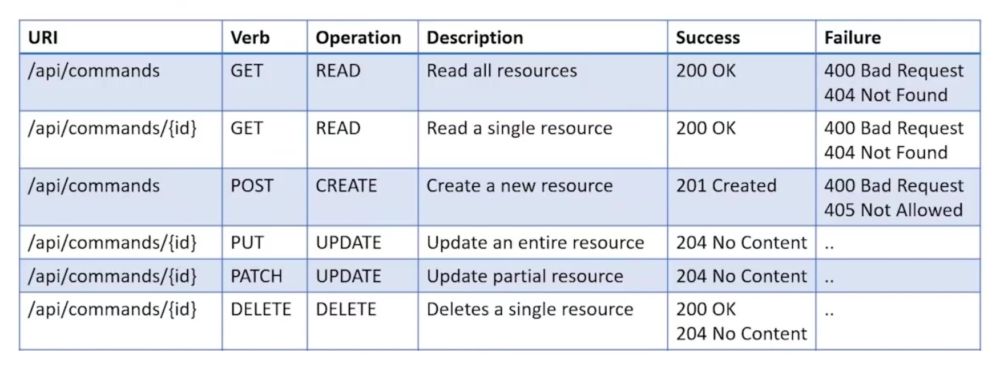
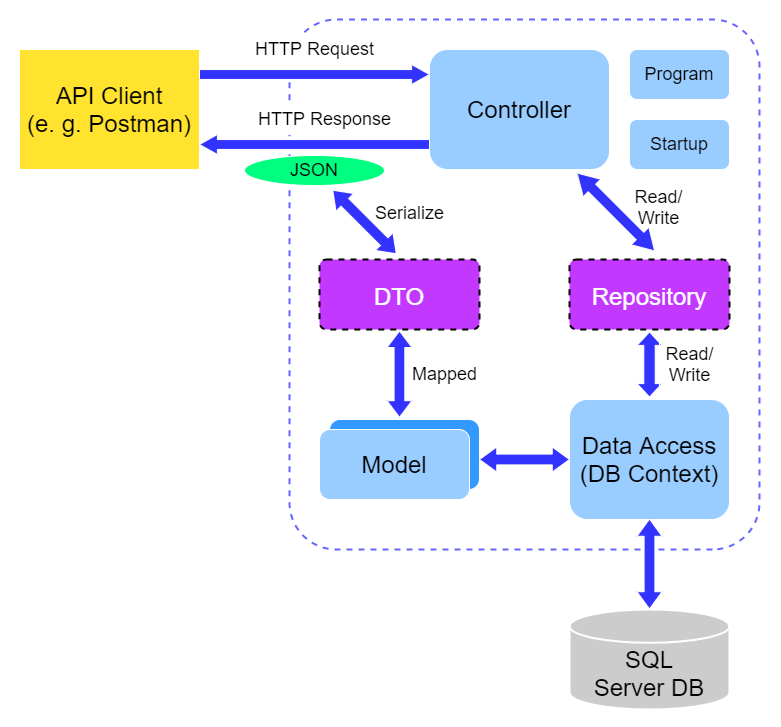

# Universalis API
Universalis API REST with .NET Core and SQL Server

## Objetive
The client must be able to make requests to the API with the specified verbs and requested data, responding with the results or confirmation of operations carried out correctly.

## How To Use
Enter a http request next to an url to request a reaction from the API which will respond with a status code according to the request and the result.

## End Points Details
  

## Application Architecture 
  

## State
It is currently finished and fully functional, having made the respective migrations to the database and entering the corresponding credentials.

##  License
This project is open-sourced software licensed under the [Apache License 2.0](https://www.apache.org/licenses/LICENSE-2.0)

##  Contact
Created by engineer [Charlie Condorcet](https://github.com/charliecondorcet)